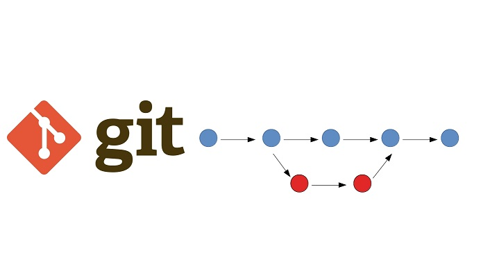

|**GIT**|консольная утилита, для ведения и отследивания истории файлов, backup, контроль 
|---|---|
git version|показывает текущую версию
git config --global user\e-mail|первоначальная настройка,создание имя пользователя, изменять e-mail
git config NOSYSTEM|отключает использование файлаобщесистемной конфигурации, если задана
git init|создание папки
cd < name-folder>|перход между папками
git add|добавление файлу версионность в локальный РЕПО
git add .|добавляет все файлы, которые есть в папаке
git add file_name|добавляет один файл, с указанным именем
git add -a|добавляет и считывает файлы из локального и удаленного репо
git commit|фиксирует изменения в РЕПО
git log|журнал изменений
git status|текущее состояние, есть ли измения
git diff|обображает разлияия входящих данных
git branch|проверка веток
git branch Branch_name|создаем ветку
git checkout|переключение между между ветками, commits
git merge branch_name|слияние веток
git push|отправить изменения
git pull|подгрузить\скачать измения из удаленного репо + слияние
git clone < ссылка>|первоначальная копия репозитория
fork|копия чужого репозитория
 ! [имя файла](название файла)|вложить изображение, предварительно положив в папку файл с ним
 Переименовать изображение| 1. правой кнопкой мыши New file, 2. назвать file: точка .gitignore 3. В этом же файле записать название name.jpg 4. git add .gitignore, git commit -m "Добавлен .gitignore" 5. git status - проверить

